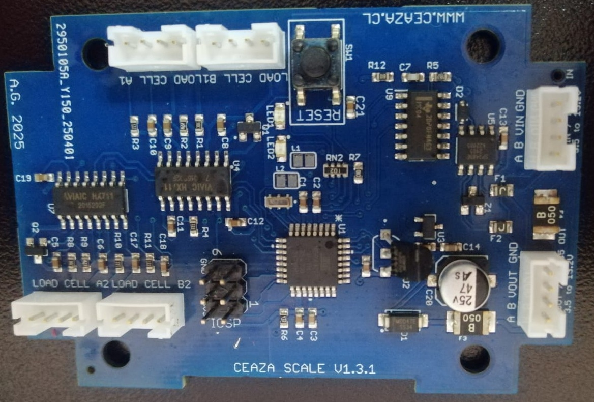

# CEAZA-Snow-Scale
  

CEAZA Snow Scale is a board designed to connect 4 load cells for the purpose of measuring snow weight in the Andes mountain range, Chile. In its v1.3.1 version, it is compatible with the protocol RS485. 

## Hardware Description

The electronic board uses an ATMEGA328P microcontroller, where the peripherals are connected to this unit. For measuring the deformation of the four load cells, two HX711 24-bit Analog-to-Digital Converter ICs are used. The RS485 communication protocol was selected for the CEAZA Snow Scale due to its long-range capability, using the SP3485EN IC as a driver. Due to the hardware's sensitivity to temperature, the DS18B20 sensor in its TO-92 package format is used for temperature measurement. 

The board has six JST connectors. Four of these are for connecting the load cells. One of them is for powering the board and for communication with other devices (via RS485). The last one is used to extend power and enable a daisy-chain topology for the RS485 protocol.

The board has two LEDs to indicate communication status with other devices, as well as a reset button for the microcontroller.

#### Schematic

  

#### BOM

The Bill of Materials (BOM) is located in the hardware folder [link](01.Hardware/02.BOM/BOM_CEAZA_SNOW_SCALE_V1.3.xls). This file contains the part IDs specific to the manufacturer JLCPCB, where version 1.3.1 of the board was fabricated, from there is possible to find other options for the components.

### LICENSES

<table>
  <tr>
    <td>
      
    </td>
    <td>
      
    </td>
  </tr>
</table>